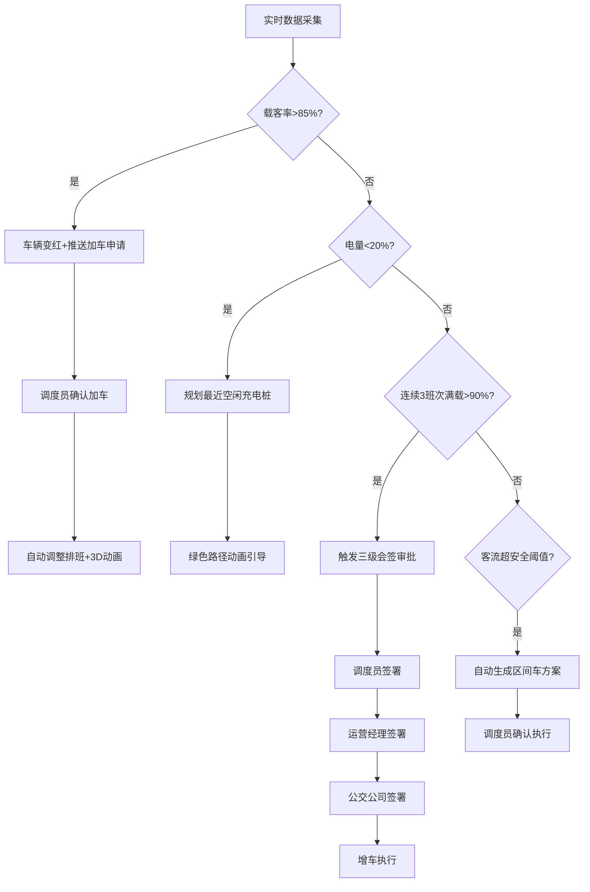

## 1. 产品概述

面向城市公交运营的3D交互可视化调度与充电管理平台，通过三维场景实时呈现首末站、沿途站点、充电桩与调度中心的全局态势，实现智能排班、自动充电引导、客流预警与多级审批闭环，提升公交运营效率与安全性。

- 核心用户：公交公司运营管理者、调度员、司机、运营经理
- 核心价值：将分散的调度、充电、客流数据统一于3D可视化界面，通过智能规则引擎实现从数据感知→自动决策→审批闭环的全链路自动化运营

## 2. 核心功能

### 2.1 用户角色

| 角色 | 注册/登录方式 | 核心权限 |
|------|--------------|----------|
| 司机 | 人脸识别登录 | 查看所属线路信息、车辆状态、充电引导 |
| 调度员 | 人脸识别登录 | 实时监控、发车调度、加车审批（一级） |
| 运营经理 | 人脸识别登录 | 排班审核、加车审批（二级）、运营报表 |
| 公交公司 | 人脸识别登录 | 全局管控、加车审批（三级）、系统配置、数据导出 |

### 2.2 功能模块

1. **3D态势总览页**：3D城市地图展示首末站/沿途站点/充电桩/调度中心，公交车3D模型实时运动，显示线路、载客率、电量；客流热力图叠加；3D时间轴排班动画
2. **智能调度中心页**：实时客流量监控、自动生成发车间隔与排班、加车审批三级会签流程、区间车方案触发
3. **充电管理页**：充电桩状态监控、低电量自动引导（绿色路径动画）、故障锁定与维修工单
4. **运营报表页**：按日期导出运营日报Excel、发车次数/平均满载率/充电次数/准点率统计

### 2.3 页面详情

| 页面名称 | 模块名称 | 功能描述 |
|----------|----------|----------|
| 3D态势总览 | 3D城市场景 | 三维地图渲染城市道路网络、首末站建筑、沿途站点、充电桩站点、调度中心大楼 |
| 3D态势总览 | 公交车模型 | 每辆车3D模型实时运动，上方悬浮信息牌显示线路号、载客率、剩余电量；载客率>85%时模型变红 |
| 3D态势总览 | 客流热力图 | 沿途站点客流密度热力图叠加，超安全阈值自动高亮并推送区间车方案 |
| 3D态势总览 | 3D时间轴 | 底部时间轴展示排班调整动画，拖动可回溯/预览调度变化 |
| 3D态势总览 | 加车申请推送 | 载客率>85%时右侧弹出加车申请卡片，一键提交或忽略 |
| 智能调度中心 | 实时客流监控 | 各线路实时客流折线图、高峰/平峰时段标识 |
| 智能调度中心 | 自动排班 | 根据客流量+时段自动计算发车间隔，3D时间轴同步展示调整动画 |
| 智能调度中心 | 三级会签审批 | 连续3班次满载率>90%触发增车审批：调度员→运营经理→公交公司逐级签署 |
| 智能调度中心 | 区间车方案 | 客流超阈值自动生成区间车方案，调度员确认后执行 |
| 充电管理 | 充电桩监控 | 所有充电桩状态列表（空闲/充电中/故障），3D场景中对应颜色标识 |
| 充电管理 | 低电量引导 | 电量<20%时自动规划至最近空闲充电桩路径，3D场景中绿色路径动画引导 |
| 充电管理 | 故障处理 | 充电桩故障自动锁定（3D中变灰），生成维修工单推送到维护人员 |
| 运营报表 | 日报生成 | 按日期选择，自动统计发车次数、平均满载率、充电次数、准点率 |
| 运营报表 | Excel导出 | 一键导出含完整统计数据的Excel文件 |

## 3. 核心流程

### 3.1 高载客率加车流程
公交车载客率超过85%时，系统自动将车辆模型标红，同时推送加车申请至调度员。调度员确认后进入排班调整流程，系统自动计算新发车间隔并通过3D时间轴展示调整动画。

### 3.2 三级会签增车审批流程
当某线路连续3个班次满载率超过90%时，系统自动触发增车审批。审批需经过调度员（一级）→运营经理（二级）→公交公司（三级）逐级签署，任何一级驳回则审批终止。

### 3.3 低电量充电引导流程
公交车电量低于20%时，系统自动搜索最近空闲充电桩，规划最优路径并在3D场景中以绿色路径动画引导车辆前往。若目标充电桩在途中故障，系统自动重新规划。

### 3.4 客流超阈值区间车流程
客流热力图检测到某区段超过安全阈值时，系统自动生成区间车方案（仅覆盖高客流区段），调度员确认后立即执行，3D场景中区间车以差异化颜色标识。

## 4. 用户界面设计

### 4.1 设计风格
- **主色调**：深蓝黑(#0a0e27)为底色，科技青(#00f0ff)为主强调色，警戒橙(#ff6b35)与危险红(#ff2d55)为告警色
- **次色调**：充电绿(#00ff88)、空闲蓝(#4dabf7)、故障灰(#6c757d)
- **按钮风格**：圆角微光按钮，hover时发光扩散效果
- **字体**：数字/数据用 JetBrains Mono，标题用 Noto Sans SC Bold，正文用 Noto Sans SC Regular
- **布局风格**：左侧3D主视图占70%，右侧信息面板占30%，底部时间轴
- **图标风格**：线性描边图标，科技感扁平风

### 4.2 页面设计概览

| 页面名称 | 模块名称 | UI元素 |
|----------|----------|--------|
| 3D态势总览 | 3D场景 | 深色地图底图、发光站点标记、3D公交车模型带悬浮信息牌、热力图半透明叠加、底部可拖拽时间轴 |
| 3D态势总览 | 右侧面板 | 实时告警列表、加车申请卡片、快捷操作按钮、线路筛选器 |
| 智能调度中心 | 客流图表 | 深色背景折线图、高峰区段高亮填充 |
| 智能调度中心 | 排班表 | 时间线甘特图、班次色块、调整动画过渡 |
| 智能调度中心 | 审批面板 | 三级审批进度条、签署按钮、审批记录时间轴 |
| 充电管理 | 充电桩列表 | 状态指示灯(绿/蓝/灰)、利用率进度条、工单状态标签 |
| 充电管理 | 3D充电引导 | 绿色发光路径线、车辆移动动画、充电桩脉冲动画 |
| 运营报表 | 日期选择器 | 日历选择、快捷日期范围 |
| 运营报表 | 数据卡片 | 大数字展示+趋势小图、Excel导出按钮 |

### 4.3 响应式设计
- 桌面端优先设计，1920x1080为基准分辨率
- 3D场景在中小屏幕下自动切换为2D俯视图
- 右侧面板可折叠，移动端转为底部抽屉

### 4.4 3D场景指导
- **环境/HDRI**：夜间城市氛围，深蓝色天空盒，地面道路微光反射
- **光照**：环境光(冷蓝)+站点/车辆点光源(暖白)+充电桩区域绿色辉光
- **相机**：俯视45度等角投影，支持旋转/缩放/平移，双击站点聚焦
- **构图**：城市路网居中，首末站为视觉锚点，公交车沿路径流动
- **交互**：点击公交车弹出详情、拖拽时间轴、滚轮缩放、右键旋转
- **后处理**：泛光(Bloom)效果增强发光元素、景深(DOF)聚焦关键区域
- **性能预算**：同屏车辆≤50辆，站点≤100个，保持60fps
