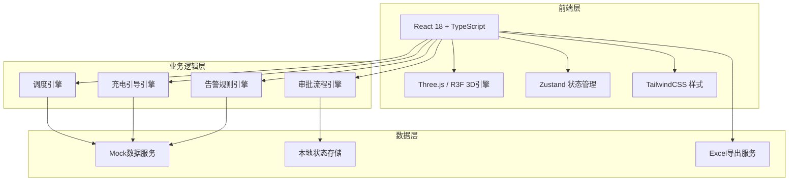
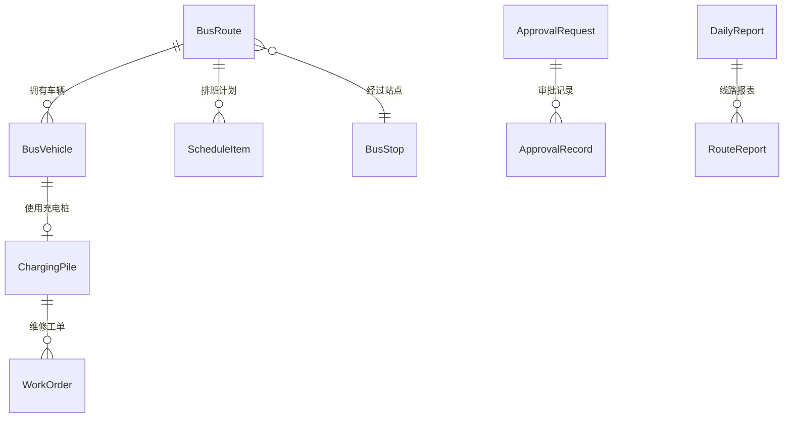

## 1. 架构设计



## 2. 技术说明

- **前端框架**：React@18 + TypeScript + Vite
- **初始化工具**：Vite (react-ts模板)
- **3D引擎**：three + @react-three/fiber + @react-three/drei + @react-three/postprocessing
- **状态管理**：Zustand
- **样式方案**：TailwindCSS@3
- **图表库**：Recharts
- **Excel导出**：xlsx (SheetJS)
- **后端**：无（纯前端Mock数据模拟）
- **数据库**：无（使用内存Mock数据 + localStorage持久化）

## 3. 路由定义

| 路由 | 用途 |
|------|------|
| / | 3D态势总览页 - 主页面，3D城市场景与实时监控 |
| /dispatch | 智能调度中心 - 客流监控、排班管理、审批流程 |
| /charging | 充电管理 - 充电桩监控、低电量引导、故障处理 |
| /reports | 运营报表 - 数据统计与Excel导出 |
| /login | 登录页 - 人脸识别/角色选择登录 |

## 4. API定义（Mock数据服务）

```typescript
interface BusVehicle {
  id: string
  routeId: string
  routeName: string
  position: [number, number, number]
  passengerRate: number
  batteryLevel: number
  status: 'running' | 'charging' | 'idle' | 'maintenance'
  currentStopIndex: number
  direction: 'forward' | 'backward'
}

interface ChargingPile {
  id: string
  name: string
  position: [number, number, number]
  status: 'idle' | 'charging' | 'fault'
  currentBusId: string | null
  faultType: string | null
}

interface BusStop {
  id: string
  name: string
  position: [number, number, number]
  type: 'terminal' | 'stop' | 'charging_station' | 'dispatch_center'
  passengerCount: number
  passengerFlow: number[]
}

interface BusRoute {
  id: string
  name: string
  color: string
  stops: string[]
  path: [number, number, number][]
  dispatchInterval: number
  schedule: ScheduleItem[]
}

interface ScheduleItem {
  id: string
  routeId: string
  busId: string
  departureTime: string
  direction: 'forward' | 'backward'
  loadRate: number
  status: 'pending' | 'departed' | 'completed'
}

interface ApprovalRequest {
  id: string
  type: 'add_bus' | 'interval_bus'
  routeId: string
  reason: string
  currentLevel: 'dispatcher' | 'manager' | 'company'
  approvals: ApprovalRecord[]
  status: 'pending' | 'approved' | 'rejected'
  createdAt: string
}

interface ApprovalRecord {
  level: 'dispatcher' | 'manager' | 'company'
  userId: string
  userName: string
  action: 'approved' | 'rejected'
  comment: string
  timestamp: string
}

interface WorkOrder {
  id: string
  chargingPileId: string
  faultType: string
  status: 'pending' | 'in_progress' | 'completed'
  createdAt: string
  assignee: string
}

interface DailyReport {
  date: string
  dispatchCount: number
  avgLoadRate: number
  chargingCount: number
  onTimeRate: number
  routeReports: RouteReport[]
}

interface RouteReport {
  routeId: string
  routeName: string
  dispatchCount: number
  avgLoadRate: number
  chargingCount: number
  onTimeRate: number
}

interface User {
  id: string
  name: string
  role: 'driver' | 'dispatcher' | 'manager' | 'company'
  avatar: string
  faceId: string
}
```

## 5. 数据模型

### 5.1 数据模型定义



### 5.2 Mock数据结构

项目使用内存Mock数据模拟所有后端服务，通过Zustand store管理状态。关键数据包括：
- 6条公交线路，每条8-12个站点
- 30辆运营车辆
- 8个充电桩（3个首末站各2个，调度中心2个）
- 2个首末站 + 1个调度中心
- 30天历史运营数据用于报表生成
